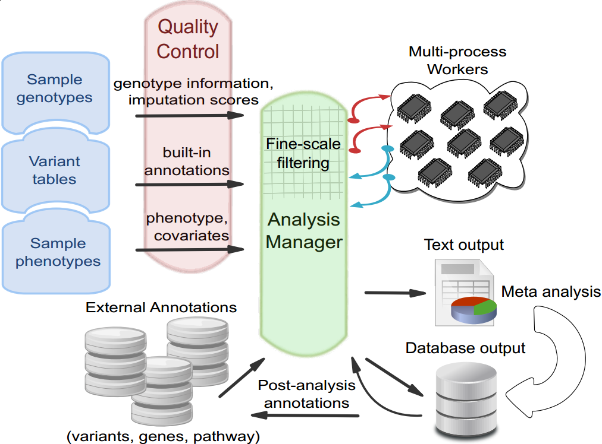

+++
title = "Association"
weight = 3
+++

## Variant Association Tools 

### 1. About

**Variant Association Tools** (VAT), designed and developed by [**Gao Wang**][1] (Baylor College of Medicine), [**Dr. Bo Peng**][2] (the University of Texas, MD Anderson Cancer Center) and [**Dr. Suzanne Leal**][3] (Baylor College of Medicine), is a new developmental branch of `variant tools` expanding its scope from analyzing individual genomic variants to analyzing large sequence data (whole genome sequencing, whole exome sequencing) or exome genotyping arrays (exome chips) from population based genotype-phenotype association studies. It features a large collection of utilities devoted to data exploration, quality control and association analysis of rare/common single nucleotide variants and indels. 

**Variant Association Tools** inherits the intuitive command-line interface of `variant tools` with re-design and implementation of its infrastructure to accommodate the scale of dataset generated from nowadays sequencing efforts on large populations. Features of Variant Association Tools are implemented into `vtools` subcommand system 

*   `vtools update`, `vtools phenotype` and `vtools_report` implements data management, exploration and quality control for association studies. Various summary statistics on variants, genotypes or samples can be obtained to learn characteristics of data, to create data cleaning filters, or to provide answers to scientific hypothesis. 
*   `vtools associate` implements a number of rare variant association tests for rare variants association analysis. We developed a *VAT ensemble method* that generalizes a number of burden tests for rare variants into a unified framework. 

*VAT* association pipeline 

### 2. Registration and download

`variant association tools` is packaged into the `variant tools` system, and shares its [mailing list][4]. Please refer to the [installation guide][5] for download and installation instructions. 

### 3. Citation

Please cite 

Gao Wang, Bo Peng and Suzanne M. Leal (2014) [**Variant Association Tools for Quality Control and Analysis of Large-Scale Sequence and Genotyping Array Data**][6], The American Journal of Human Genetics 94 (5): 770–83. 

if you find Variant Association Tools helpful and use it in your publication. Thank you. 

### 4. Data Exploration and Quality Control

We demonstrate data exploration and QC in [a few tutorials][7] available from this website. You may start with the intro tutorial and move on to advanced in preparation for your real world project. Please contact us if you think additional data exploration and QC steps should be included in the VAT QC pipeline. 

### 5. Association Tests

Statistical tests for association are implemented under `vtools associate`, and can be categorized as 

*   Single gene rare variant tests, including *CMC, BRV, KBAC, WSS, RBT, VT, aSum, RareCover, c-alpha*, etc; 
*   Rare variants analysis conditional on arbitrary phenotype covariates for both disease and quantitative traits, including *CollapsedTest, BurdenTest, VariableThresholdsTest, WeightedBurdenTest-WSS, WeightedBurdenTest-KBAC, WeightedBurdenTest-RBT*; 
*   Two flexible regression methods allowing for combination of several internal weighting themes and any arbitrary external weights (e.g., functional information) as well as the variable thresholds framework; 
*   Association testing interface to external software, including the `R` package `SKAT` and the `SCORE-Seq` program; 
*   Ancillary routines reporting basic statistics for association test units (`GroupStat`) or exporting the association data from project database (`GroupWrite`). 

The flexible regression framework naturally supports single SNV analysis (for common variants). It also provides analysis of imputed genotype data although some weighting themes may not apply. For data with missing genotypes (either due to genotype calling failure or QC cleaning) remedies are available for several burden tests based on Auer et al 2013(personal communication with Paul L. Auer at Fred Hutchinson Cancer Research Center). For implementation details of each method, please refer to this [documentation] on rare variants association methods. 

### 6. Fine-scale Data Cleaning for Association Test Units

Associate tests for rare variants are often carried out by units of *groups*, which is usually *genes* in the context of exome analysis. The distribution of missing genotype data in each group might be different, and as has been discussed in previous section it is recommended to perform fine-scale cleaning of missing data while running association analysis. This is implemented as options `--discard_samples '%(NA)>p'` and `--discard_variants '%(NA)>p'`. The first option will dynamically remove samples having more than a proportion of {$p$} missing genotypes within each association *group*; the second option will remove variant sites based on specified missingness criteria after the first option is applied. 

For genes having too few variant sites after data cleaning, we can analyze them first yet keep a record of the actual number of variant sites that contributed to each association test unit (using `GroupStat`) and clean out the results for groups failing to satisfy some minimum variant sites cut-off. 

### 7. Storing and Representing Association Results

Results from association analysis are available as commandline standard output which can be redirected to a file. It is also possible (and is strongly recommended) to record the results into an annotation database via `--to_db` option. Using a database to store the results will not only facilitate post-analysis variant selection/output conditioning on variant properties annotated by association analysis, but also make it possible to interrupt an association scan at any time and resume the analysis without having to start all over. Association results ({$p$} values) can be graphically viewed using AssociationViewer, a utility software that produces high quality QQ and Manhattan plots of {$p$} values. 

 [1]: mailto:wangow@gmail.com
 [2]: mailto:bpeng@mdanderson.org
 [3]: http://www.bcm.edu/genetics/?pmid=10939
 [4]: mailto:varianttools-devel@lists.sourceforge.net
 [5]: /vat-docs/installation/
 [6]: http://dx.doi.org/10.1016/j.ajhg.2014.04.004
 [7]: /vat-docs/applications/association/qc/