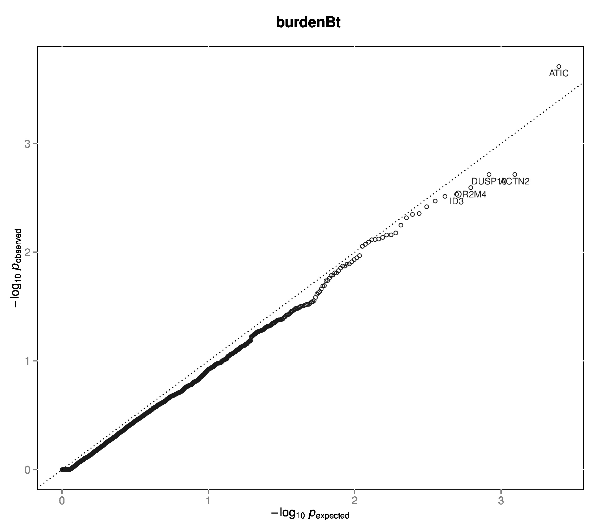

+++
title = "aggregation"
weight = 2
+++

## Aggregation Methods for Disease and Quantitative Traits 

### 1. Introduction

This is implementation of the fixed threshold aggregation methods for disease and quantitative traits. Originally described in (Morris and Zeggni, 2010) and known as Gene- or Region-based Analysis of Variants of Intermediate and Low frequency (GRANVIL), the *Aggregation* method for rare variants codes observed genotype of a genetic region the count of minor alleles:  $$X = \sum\_i^N X\_i$$

Our program implements the aggregation methods in a logistic regression framework for disease traits analysis (case control data) as `BurdenBt` method, and a linear regression framework for quantitative traits analysis as `BurdenQt` method. \\(p\\) value for aggregation method is based on asymptotic normal distribution of the Wald statistic in generalized linear models. One could incorporate a number of phenotype covariates in collapsing tests and evaluate the significance of the genetics component. 

#### 1.1 Adjust for missing genotypes

The same `--NA_adjust` option is avaliable as with [collapsing methods][1] although they slightly differ in details, as described in (Auer et al, 2013). 

### 2. Details

#### 2.1 Command interface

    vtools show test BurdenBt

    Name:          BurdenBt
    Description:   Burden test for disease traits, Morris & Zeggini 2009
    usage: vtools associate --method BurdenBt [-h] [--name NAME]
                                              [--mafupper MAFUPPER]
                                              [--alternative TAILED] [--NA_adjust]
                                              [--moi {additive,dominant,recessive}]
    
    Fixed threshold burden test for disease traits (Morris & Zeggini 2009).
    p-value is based on the significance level of the regression coefficient for
    genotypes. If --group_by option is specified, the group of variants will be
    coded using the counts of variants within the group.
    
    optional arguments:
      -h, --help            show this help message and exit
      --name NAME           Name of the test that will be appended to names of
                            output fields, usually used to differentiate output of
                            different tests, or the same test with different
                            parameters.
      --mafupper MAFUPPER   Minor allele frequency upper limit. All variants
                            having sample MAF<=m1 will be included in analysis.
                            Default set to 0.01
      --alternative TAILED  Alternative hypothesis is one-sided ("1") or two-sided
                            ("2"). Default set to 1
      --NA_adjust           This option, if evoked, will replace missing genotype
                            values with a score relative to sample allele
                            frequencies. The association test will be adjusted to
                            incorporate the information. This is an effective
                            approach to control for type I error due to
                            differential degrees of missing genotypes among
                            samples.
      --moi {additive,dominant,recessive}
                            Mode of inheritance. Will code genotypes as 0/1/2/NA
                            for additive mode, 0/1/NA for dominant or recessive
                            model. Default set to additive
    

    vtools show test BurdenQt

    Name:          BurdenQt
    Description:   Burden test for quantitative traits, Morris & Zeggini 2009
    usage: vtools associate --method BurdenQt [-h] [--name NAME]
                                              [--mafupper MAFUPPER]
                                              [--alternative TAILED] [--NA_adjust]
                                              [--moi {additive,dominant,recessive}]
    
    Fixed threshold burden test for quantitative traits (Morris & Zeggini 2009).
    p-value is based on the significance level of the regression coefficient for
    genotypes. If --group_by option is specified, the group of variants will be
    coded using the counts of variants within the group.
    
    optional arguments:
      -h, --help            show this help message and exit
      --name NAME           Name of the test that will be appended to names of
                            output fields, usually used to differentiate output of
                            different tests, or the same test with different
                            parameters.
      --mafupper MAFUPPER   Minor allele frequency upper limit. All variants
                            having sample MAF<=m1 will be included in analysis.
                            Default set to 0.01
      --alternative TAILED  Alternative hypothesis is one-sided ("1") or two-sided
                            ("2"). Default set to 1
      --NA_adjust           This option, if evoked, will replace missing genotype
                            values with a score relative to sample allele
                            frequencies. The association test will be adjusted to
                            incorporate the information. This is an effective
                            approach to control for type I error due to
                            differential degrees of missing genotypes among
                            samples.
      --moi {additive,dominant,recessive}
                            Mode of inheritance. Will code genotypes as 0/1/2/NA
                            for additive mode, 0/1/NA for dominant or recessive
                            model. Default set to additive
    

#### 2.2 Application

 Example using **snapshot** `vt_ExomeAssociation`
 

    vtools associate rare status --covariates gender age bmi exposure -m "BurdenBt --name Burde\
    nBt --alternative 2" --group_by name2 --to_db burdenBt -j8 > burdenBt.txt

    INFO: 3180 samples are found
    INFO: 2632 groups are found
    INFO: Starting 8 processes to load genotypes
    Loading genotypes: 100% [========================================] 3,180 33.0/s in 00:01:36
    Testing for association: 100% [=========================================] 2,632/147 25.3/s in 00:01:43
    INFO: Association tests on 2632 groups have completed. 147 failed.
    INFO: Using annotation DB burdenBt in project test.
    INFO: Annotation database used to record results of association tests. Created on Wed, 30 Jan 2013 17:39:05
    

    vtools show fields | grep burdenBt

    burdenBt.name2               name2
    burdenBt.sample_size_BurdenBt sample size
    burdenBt.num_variants_BurdenBt number of variants in each group (adjusted for specified MAF
    burdenBt.total_mac_BurdenBt  total minor allele counts in a group (adjusted for MOI)
    burdenBt.beta_x_BurdenBt     test statistic. In the context of regression this is estimate of
    burdenBt.pvalue_BurdenBt     p-value
    burdenBt.wald_x_BurdenBt     Wald statistic for x (beta_x/SE(beta_x))
    burdenBt.beta_2_BurdenBt     estimate of beta for covariate 2
    burdenBt.beta_2_pvalue_BurdenBt p-value for covariate 2
    burdenBt.wald_2_BurdenBt     Wald statistic for covariate 2
    burdenBt.beta_3_BurdenBt     estimate of beta for covariate 3
    burdenBt.beta_3_pvalue_BurdenBt p-value for covariate 3
    burdenBt.wald_3_BurdenBt     Wald statistic for covariate 3
    burdenBt.beta_4_BurdenBt     estimate of beta for covariate 4
    burdenBt.beta_4_pvalue_BurdenBt p-value for covariate 4
    burdenBt.wald_4_BurdenBt     Wald statistic for covariate 4
    burdenBt.beta_5_BurdenBt     estimate of beta for covariate 5
    burdenBt.beta_5_pvalue_BurdenBt p-value for covariate 5
    burdenBt.wald_5_BurdenBt     Wald statistic for covariate 5
    

    head burdenBt.txt
    
    name2	sample_size_BurdenBt	num_variants_BurdenBt	total_mac_BurdenBt	beta_x_BurdenBt	pvalue_BurdenBt	wald_x_BurdenBt	beta_2_BurdenBt	beta_2_pvalue_BurdenBt	wald_2_BurdenBt	beta_3_BurdenBt	beta_3_pvalue_BurdenBt	wald_3_BurdenBt	beta_4_BurdenBt	beta_4_pvalue_BurdenBt	wald_4_BurdenBt	beta_5_BurdenBt	beta_5_pvalue_BurdenBt	wald_5_BurdenBt
    AADACL4	3180	5	138	-0.314582	0.321174	-0.992049	-0.295836	0.0157002	-2.41581	0.031285	4.33616E-09	5.87083	0.129902	1.92805E-40	13.3137	0.437291	0.00133887	3.20752
    AAMP	3180	3	35	0.00135633	0.997852	0.0026919	-0.298944	0.0146254	-2.44152	0.0312624	4.39097E-09	5.86875	0.130231	1.24946E-40	13.346	0.43547	0.00139464	3.19576
    ABCG8	3180	12	152	-0.432823	0.171192	-1.36838	-0.295762	0.0157794	-2.41398	0.0314772	3.67916E-09	5.89801	0.130108	1.52929E-40	13.331	0.440976	0.001228	3.2323
    ABCG5	3180	6	87	0.324674	0.3172	1.00023	-0.2988	0.0146577	-2.44073	0.0312857	4.15942E-09	5.87773	0.130409	9.33403E-41	13.3677	0.439149	0.00127711	3.22107
    ABCB10	3180	6	122	0.333178	0.219379	1.22818	-0.301597	0.013796	-2.46253	0.0312644	4.40563E-09	5.8682	0.130493	9.8029E-41	13.3641	0.431826	0.00154525	3.16605
    ABHD1	3180	5	29	-0.149027	0.813232	-0.236258	-0.298211	0.0148918	-2.435	0.0312405	4.49306E-09	5.86494	0.130264	1.16337E-40	13.3513	0.436326	0.001369	3.20111
    ABCB6	3180	7	151	-0.00762322	0.977401	-0.028327	-0.299001	0.0146089	-2.44193	0.0312671	4.42259E-09	5.86756	0.130228	1.17642E-40	13.3505	0.435506	0.00139372	3.19595
    ABI2	3180	1	25	0.982737	0.0422609	2.03094	-0.30075	0.0140623	-2.45567	0.0311325	4.9292E-09	5.84954	0.129821	1.95802E-40	13.3125	0.436794	0.00135518	3.20403
    ABL2	3180	4	41	0.192361	0.698251	0.387682	-0.298745	0.0146809	-2.44016	0.0312678	4.39516E-09	5.86859	0.130322	1.10243E-40	13.3553	0.436387	0.00136405	3.20215
    
**QQ-plot** 
 

    vtools associate rare bmi --covariates gender age exposure -m "BurdenQt --name BurdenQt --a\
    lternative 2" --group_by name2 --to_db burdenQt -j8 > burdenQt.txt
    
    INFO: 3180 samples are found
    INFO: 2632 groups are found
    INFO: Starting 8 processes to load genotypes
    Loading genotypes: 100% [===========================] 3,180 33.7/s in 00:01:34
    Testing for association: 100% [=========================] 2,632/147 26.2/s in 00:01:40
    INFO: Association tests on 2632 groups have completed. 147 failed.
    INFO: Using annotation DB burdenQt in project test.
    INFO: Annotation database used to record results of association tests. Created on Wed, 30 Jan 2013 23:01:44
    

    vtools show fields | grep burdenQt
    
    burdenQt.name2               name2
    burdenQt.sample_size_BurdenQt sample size
    burdenQt.num_variants_BurdenQt number of variants in each group (adjusted for specified MAF
    burdenQt.total_mac_BurdenQt  total minor allele counts in a group (adjusted for MOI)
    burdenQt.beta_x_BurdenQt     test statistic. In the context of regression this is estimate of
    burdenQt.pvalue_BurdenQt     p-value
    burdenQt.wald_x_BurdenQt     Wald statistic for x (beta_x/SE(beta_x))
    burdenQt.beta_2_BurdenQt     estimate of beta for covariate 2
    burdenQt.beta_2_pvalue_BurdenQt p-value for covariate 2
    burdenQt.wald_2_BurdenQt     Wald statistic for covariate 2
    burdenQt.beta_3_BurdenQt     estimate of beta for covariate 3
    burdenQt.beta_3_pvalue_BurdenQt p-value for covariate 3
    burdenQt.wald_3_BurdenQt     Wald statistic for covariate 3
    burdenQt.beta_4_BurdenQt     estimate of beta for covariate 4
    burdenQt.beta_4_pvalue_BurdenQt p-value for covariate 4
    burdenQt.wald_4_BurdenQt     Wald statistic for covariate 4
    

    head burdenQt.txt
    
    name2	sample_size_BurdenQt	num_variants_BurdenQt	total_mac_BurdenQt	beta_x_BurdenQt	pvalue_BurdenQt	wald_x_BurdenQt	beta_2_BurdenQt	beta_2_pvalue_BurdenQt	wald_2_BurdenQt	beta_3_BurdenQt	beta_3_pvalue_BurdenQt	wald_3_BurdenQt	beta_4_BurdenQt	beta_4_pvalue_BurdenQt	wald_4_BurdenQt
    AADACL4	3180	5	138	-0.461457	0.308686	-1.01815	-0.0716573	0.726877	-0.349314	0.0150768	0.0574562	1.90051	-0.939843	2.75155E-05	-4.19925
    ABCB10	3180	6	122	0.119	0.814045	0.23523	-0.0795874	0.697984	-0.388079	0.0150143	0.0585374	1.89233	-0.945568	2.50587E-05	-4.2205
    ABHD1	3180	5	29	0.00268703	0.997829	0.00272057	-0.0787737	0.700934	-0.384095	0.0150272	0.0583193	1.89397	-0.943247	2.5858E-05	-4.21338
    ABCA4	3180	43	492	0.0820913	0.74098	0.330584	-0.0787295	0.701037	-0.383955	0.0150093	0.0586193	1.89172	-0.942885	2.59414E-05	-4.21265
    ABI2	3180	1	25	1.19633	0.276415	1.0886	-0.081478	0.691101	-0.397397	0.0150043	0.0586562	1.89144	-0.941765	2.64399E-05	-4.20833
    ABL2	3180	4	41	-0.613866	0.475633	-0.713429	-0.0781101	0.703263	-0.380954	0.0150498	0.0579226	1.89697	-0.945432	2.46814E-05	-4.22394
    ACADL	3180	5	65	1.30339	0.0536027	1.93075	-0.0819058	0.689433	-0.39966	0.0150828	0.0572499	1.90209	-0.940465	2.6925E-05	-4.20419
    ACADM	3180	4	103	0.0561593	0.916101	0.105355	-0.0778643	0.704415	-0.379401	0.0150232	0.0583868	1.89347	-0.942722	2.61415E-05	-4.2109
    ACAP3	3180	3	17	0.296682	0.823678	0.222835	-0.07936	0.698787	-0.386993	0.0150257	0.0583418	1.8938	-0.942487	2.61991E-05	-4.2104
    
**QQ-plot** 
 

### Reference

Andrew P. Morris and Eleftheria Zeggini (2010) **An evaluation of statistical approaches to rare variant analysis in genetic association studies**. *Genetic Epidemiology* doi:`10.1002/gepi.20450`. <http://doi.wiley.com/10.1002/gepi.20450>

Auer et al (2013) personal communication with Paul L. Auer at Fred Hutchinson Cancer Research Center

 [1]:   /applications/association/joint_conditional/collapisng/