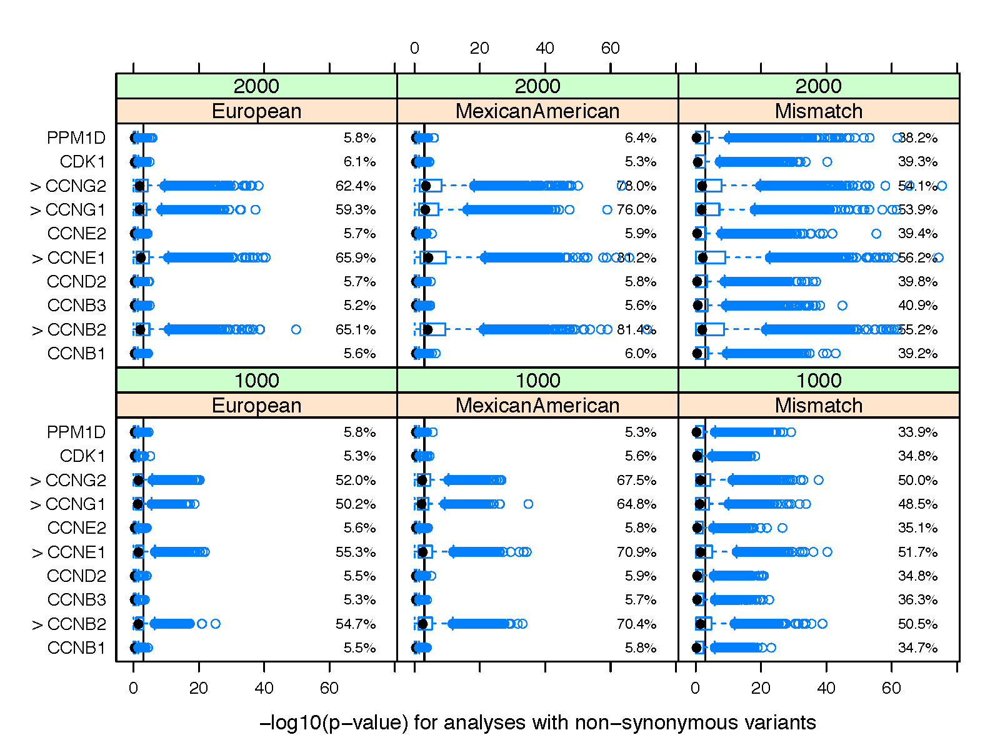

+++
title = "Peng2014_ex2"
weight = 2
+++

## Second example in Peng (2014) Genetic Epidemiology

### 1. Usage

    % vtools show simulation Peng2014_ex2
    

    Simulation of case control samples for 20 genes and analyze samples of different sizes (1000,
    2000, 3000, 4000 cases and matching number of controls) draw from European, Mexican American
    (mixed and matched case and control), and from both Asian (cases) and European (controls)
    populations for a mismatch design. This simulation model has been used to simulate data for the
    second example in paper "Reproducible Simulations of realistic samples for next-gen sequencing
    studies using Variant Simulation Tools". The generated samples are analyzed using Variant
    Association Tools, first for all variants and then for non-synoymous variants.
    
    Available simulation models: European, MexicanAmerican, Mismatch
    
    Model "European":  This model draws cases and controls from simulated European population.
      European_0:         Check the version of variant tools. Version 2.3.1 or higher is required
                          for the execution of this simulation.
      European_1:         Import required modules.
      European_10:        Create a new project Peng2014_ex2 and link the refGene and ccdsGene_exon
                          databases to the project.
      European_30:        Create an empty simuPOP population for specified regions.
      European_40:        Evolve and expand the population using a K80 mutation model       and a
                          demographic model that models the settlement of new world model of the
                          Mexican American population, without mixing the final populations.
      European_50:        Get allele frequency spectrum in a sample of 700 individuals.
      European_100:       Draw 1000 cases and 1000 controls from the European population.
      European_110:       Create a new project Peng2014_ex2 and link the refGene and ccdsGene_exon
                          databases to the project.
      European_120:       Export genotype and phenotype simulated samples in vcf and text formats,
                          respectively.
      European_130:       Import data into a variant tools project.
      European_140:       Analyze the project using variant association tools.
      European_150:       Call snpEff to annotate variants.
      European_160:       Select non-synonymous variants according to snpEff annotation.
      European_170:       Analyze the project using non-synonymous variants.
      European_200:       Draw 2000 cases and 2000 controls from the European population.
      European_210:       Create a new project Peng2014_ex2 and link the refGene and ccdsGene_exon
                          databases to the project.
      European_220:       Export genotype and phenotype simulated samples in vcf and text formats,
                          respectively.
      European_230:       Import data into a variant tools project.
      European_240:       Analyze the project using variant association tools.
      European_250:       Call snpEff to annotate variants.
      European_260:       Select non-synonymous variants according to snpEff annotation.
      European_270:       Analyze the project using non-synonymous variants.
      European_300:       Draw 3000 cases and 3000 controls from the European population.
      European_310:       Create a new project Peng2014_ex2 and link the refGene and ccdsGene_exon
                          databases to the project.
      European_320:       Export genotype and phenotype simulated samples in vcf and text formats,
                          respectively.
      European_330:       Import data into a variant tools project.
      European_340:       Analyze the project using variant association tools.
      European_350:       Call snpEff to annotate variants.
      European_360:       Select non-synonymous variants according to snpEff annotation.
      European_370:       Analyze the project using non-synonymous variants.
      European_400:       Draw 4000 cases and 4000 controls from the European population.
      European_410:       Create a new project Peng2014_ex2 and link the refGene and ccdsGene_exon
                          databases to the project.
      European_420:       Export genotype and phenotype simulated samples in vcf and text formats,
                          respectively.
      European_430:       Import data into a variant tools project.
      European_440:       Analyze the project using variant association tools.
      European_450:       Call snpEff to annotate variants.
      European_460:       Select non-synonymous variants according to snpEff annotation.
      European_470:       Analyze the project using non-synonymous variants.
    
    Model "MexicanAmerican":  This model draws samples from Mexican American population which is
    mixed from Eurpean and Mexican populations.
      MexicanAmerican_0:  Check the version of variant tools. Version 2.3.1 or higher is required
                          for the execution of this simulation.
      MexicanAmerican_1:  Import required modules.
      MexicanAmerican_10: Create a new project Peng2014_ex2 and link the refGene and ccdsGene_exon
                          databases to the project.
      MexicanAmerican_30: Create an empty simuPOP population for specified regions.
      MexicanAmerican_40: Evolve and expand the population using a K80 mutation model       and a
                          demographic model that models the settlement of new world model of the
                          Mexican American population.
      MexicanAmerican_50: Get allele frequency spectrum in a sample of 700 individuals.
      MexicanAmerican_100:Draw 1000 cases and 1000 controls from the mixed Mexican American
                          population.
      MexicanAmerican_110:Create a new project Peng2014_ex2 and link the refGene and ccdsGene_exon
                          databases to the project.
      MexicanAmerican_120:Export genotype and phenotype simulated samples in vcf and text formats,
                          respectively.
      MexicanAmerican_130:Import data into a variant tools project.
      MexicanAmerican_140:Analyze the project using variant association tools.
      MexicanAmerican_150:Call snpEff to annotate variants.
      MexicanAmerican_160:Select non-synonymous variants according to snpEff annotation.
      MexicanAmerican_170:Analyze the project using non-synonymous variants.
      MexicanAmerican_200:Draw 2000 cases and 2000 controls from the mixed Mexican American
                          population.
      MexicanAmerican_210:Create a new project Peng2014_ex2 and link the refGene and ccdsGene_exon
                          databases to the project.
      MexicanAmerican_220:Export genotype and phenotype simulated samples in vcf and text formats,
                          respectively.
      MexicanAmerican_230:Import data into a variant tools project.
      MexicanAmerican_240:Analyze the project using variant association tools.
      MexicanAmerican_250:Call snpEff to annotate variants.
      MexicanAmerican_260:Select non-synonymous variants according to snpEff annotation.
      MexicanAmerican_270:Analyze the project using non-synonymous variants.
      MexicanAmerican_300:Draw 3000 cases and 3000 controls from the mixed Mexican American
                          population.
      MexicanAmerican_310:Create a new project Peng2014_ex2 and link the refGene and ccdsGene_exon
                          databases to the project.
      MexicanAmerican_320:Export genotype and phenotype simulated samples in vcf and text formats,
                          respectively.
      MexicanAmerican_330:Import data into a variant tools project.
      MexicanAmerican_340:Analyze the project using variant association tools.
      MexicanAmerican_350:Call snpEff to annotate variants.
      MexicanAmerican_360:Select non-synonymous variants according to snpEff annotation.
      MexicanAmerican_370:Analyze the project using non-synonymous variants.
      MexicanAmerican_400:Draw 4000 cases and 4000 controls from the mixed Mexican American
                          population.
      MexicanAmerican_410:Create a new project Peng2014_ex2 and link the refGene and ccdsGene_exon
                          databases to the project.
      MexicanAmerican_420:Export genotype and phenotype simulated samples in vcf and text formats,
                          respectively.
      MexicanAmerican_430:Import data into a variant tools project.
      MexicanAmerican_440:Analyze the project using variant association tools.
      MexicanAmerican_450:Call snpEff to annotate variants.
      MexicanAmerican_460:Select non-synonymous variants according to snpEff annotation.
      MexicanAmerican_470:Analyze the project using non-synonymous variants.
    
    Model "Mismatch":  This model draws cases from Asian population and controls from European
    population.
      Mismatch_0:         Check the version of variant tools. Version 2.3.1 or higher is required
                          for the execution of this simulation.
      Mismatch_1:         Import required modules.
      Mismatch_10:        Create a new project Peng2014_ex2 and link the refGene and ccdsGene_exon
                          databases to the project.
      Mismatch_30:        Create an empty simuPOP population for specified regions.
      Mismatch_40:        Evolve and expand the population using a K80 mutation model       and a
                          demographic model that models the settlement of new world model of the
                          Mexican American population, without mixing the final populations.
      Mismatch_50:        Get allele frequency spectrum in a sample of 700 individuals.
      Mismatch_100:       Draw 1000 cases from the European population and 1000 controls from the
                          Asian population.
      Mismatch_110:       Create a new project Peng2014_ex2 and link the refGene and ccdsGene_exon
                          databases to the project.
      Mismatch_120:       Export genotype and phenotype simulated samples in vcf and text formats,
                          respectively.
      Mismatch_130:       Import data into a variant tools project.
      Mismatch_140:       Analyze the project using variant association tools.
      Mismatch_150:       Call snpEff to annotate variants.
      Mismatch_160:       Select non-synonymous variants according to snpEff annotation.
      Mismatch_170:       Analyze the project using non-synonymous variants.
      Mismatch_200:       Draw 2000 cases from the European population and 2000 controls from the
                          Asian population.
      Mismatch_210:       Create a new project Peng2014_ex2 and link the refGene and ccdsGene_exon
                          databases to the project.
      Mismatch_220:       Export genotype and phenotype simulated samples in vcf and text formats,
                          respectively.
      Mismatch_230:       Import data into a variant tools project.
      Mismatch_240:       Analyze the project using variant association tools.
      Mismatch_250:       Call snpEff to annotate variants.
      Mismatch_260:       Select non-synonymous variants according to snpEff annotation.
      Mismatch_270:       Analyze the project using non-synonymous variants.
      Mismatch_300:       Draw 3000 cases from the European population and 3000 controls from the
                          Asian population.
      Mismatch_310:       Create a new project Peng2014_ex2 and link the refGene and ccdsGene_exon
                          databases to the project.
      Mismatch_320:       Export genotype and phenotype simulated samples in vcf and text formats,
                          respectively.
      Mismatch_330:       Import data into a variant tools project.
      Mismatch_340:       Analyze the project using variant association tools.
      Mismatch_350:       Call snpEff to annotate variants.
      Mismatch_360:       Select non-synonymous variants according to snpEff annotation.
      Mismatch_370:       Analyze the project using non-synonymous variants.
      Mismatch_400:       Draw 4000 cases from the European population and 4000 controls from the
                          Asian population.
      Mismatch_410:       Create a new project Peng2014_ex2 and link the refGene and ccdsGene_exon
                          databases to the project.
      Mismatch_420:       Export genotype and phenotype simulated samples in vcf and text formats,
                          respectively.
      Mismatch_430:       Import data into a variant tools project.
      Mismatch_440:       Analyze the project using variant association tools.
      Mismatch_450:       Call snpEff to annotate variants.
      Mismatch_460:       Select non-synonymous variants according to snpEff annotation.
      Mismatch_470:       Analyze the project using non-synonymous variants.
    
    Model parameters:
      regions             One or more chromosome regions (separated by ',') in the format of chr
                          :start-end (e.g. chr21:33031597-33041570), or Field:Value from a region-
                          based annotation database (e.g. refGene.name2:TRIM2 or
                          refGene_exon.name:NM_000947). Please visit
                          http://varianttools.sourceforge.net/Simulation for detailed description of
                          this parameter. (default: ccdsGene_exon.name:CCDS12419.1,CCDS46035.1,CCDS4
                          360.1,CCDS3581.1,CCDS10170.1,CCDS6264.1,CCDS1708.1,CCDS44408.1,CCDS7260.1,
                          CCDS47427.1,CCDS47426.1,CCDS47425.1,CCDS4863.1,CCDS8524.1,CCDS3997.1,CCDS6
                          035.1,CCDS6036.1,CCDS14332.1,CCDS14331.1,CCDS11625.1)
      causing_genes       A subset of regions from which a phenotype is simulated. (default:
                          ccdsGene_exon.name:CCDS12419.1,CCDS46035.1,CCDS4360.1,CCDS3581.1,CCDS10170
                          .1)
      scale               Scaling factor to speed up the simulation by scaling down the simulation
                          while boosting mutation, selection and recombination rates. (default: 4)
    

### 2. Model

This example simulates a miniature exome sequencing study with variants in the exon regions of 20 genes (isoforms) in the G Protein Coupled Receptors signaling pathway. These genes reside on chromosomes 6, 8, and 10 and chromosome X. The simulated regions overlap with 27 isoforms of 15 genes in the NCBI reference sequences database [Pruitt, et al. 2007]. The coding regions of these genes range from 563 to 1818 base pairs and represents 16.2% of the total simulated region (17,841 of 110,387 bp). 

The demographic model starts with an ancestral population of 7,300 individuals and evolves for 100,000 generations, following a Settlement of New World model that models the evolution of Africa, Asian, Mexican, and European populations and the formation of the Mexican American population [Gutenkunst, et al. 2009]. The evolutionary process was subject to the influence of a K80 nucleotide mutation model [Kimura 1980] with a mutation rate of 1.8 × 10–8 and a transition transversion ratio of 2, a fine-scale recombination with hotspot model with average recombination rate (per region) ranging from 6.14 × 10–9 to 6.23 × 10–6, and a natural selection model with selection coefficients of 0.0001, 0.0001, and 0.001 for missense, stoploss, and stopgain mutations, respectively. Part of the evolutionary process (80,000 of the 91,200 generation burn-in stage) was shared among replicate simulations by starting the simulations from a saved population. A scaling factor of 4 was used to speed up the simulations. 

A genetic disease caused by non-synonymous mutations in four of the 15 simulated genes is simulated. Under this penetrance model, an individual who carries a missense, stoploss, and stopgain mutation has probabilities of 0.001, 0.001, and 0.01, respectively, to be affected. Individuals will have higher probabilities to be affected if they carry more than one mutation (a multiplicative model is used) and a probability of 0.0001 if they carry no non-synonymous mutation. We drew 1000 and 2000 cases and matching numbers of controls from the simulated populations of size 151,521 using three models. The first model drew cases and controls from the same European population; the second model drew cases and controls from the Mexican American population, which is admixed from the Mexican and European populations; and the third model drew cases from the Asian population and controls from the European population. We applied a burden test proposed by Morris and Zeggini [2010] to each of the simulated datasets, first to all variants, then to only non-synonymous, stopgain, and stoploss variants identified by snpEff [Cingolani, et al. 2012]. Five genes were excluded from the latter analysis because of small numbers of non-synonymous mutations in these genes. 

### 3. Results

 

The following figures plot the box-and-whisker plots of negative log10 p-values for association analyses between disease status and all variants (figure a) or all non-synonymous mutations (Figure b) using 1000 (bottom) or 2000 (top) cases and matching numbers of controls. In contrast to the European and Mexican American simulations, which had reasonable false-positive rates (approximately 5% for significance level 0.05) for non-causing genes, analyses of the mismatch simulations yielded high proportions of spurious associations between all genes and disease status. This signifies the importance of using ethnicity-matched samples for case-control association analysis and the danger of using public controls (e.g., data from the 1000 Genomes Project) for association analysis. Because the disease is caused by non-synonymous mutations in the causal genes, limiting association tests to such variants is predictably more powerful than tests based on all variants. It is interesting, however, that association tests using an admixed population are more powerful than tests using all European samples. The reasons behind this phenomenon require further investigation of the distribution of causal variants in the simulated populations.