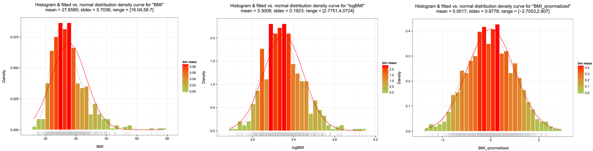
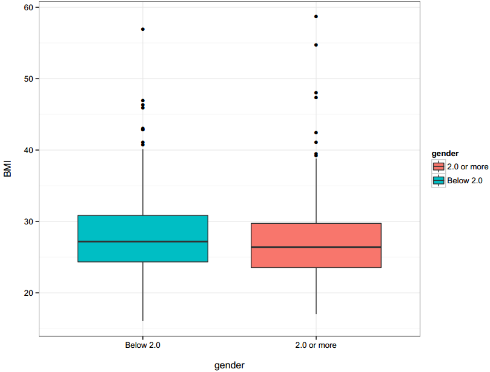
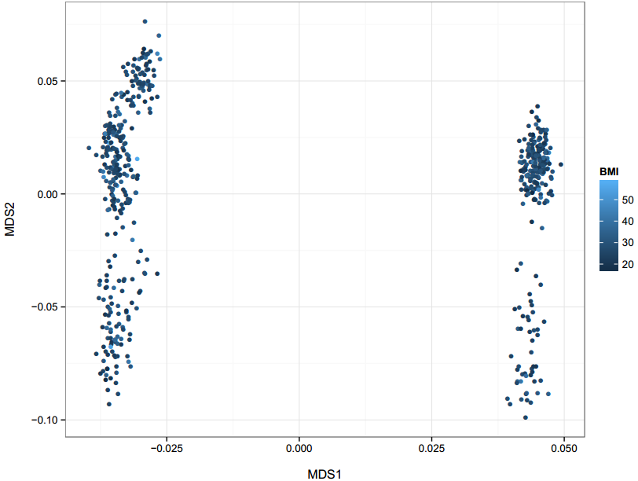
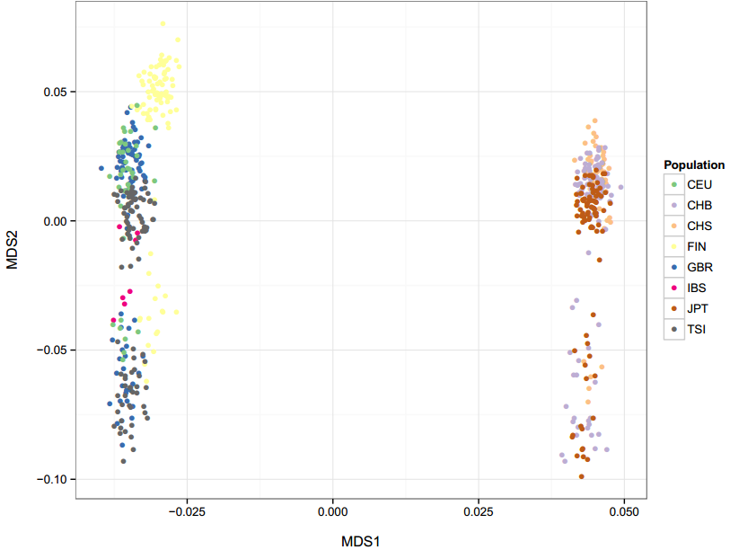

+++
title = "plot_pheno_fields"
weight = 12
+++

## Plot Sample phenotype fields

### 1. Usage

    % vtools_report plot_pheno_fields -h
    

    usage: vtools_report plot_pheno_fields [-h]
                                           [--samples [SAMPLES [SAMPLES ...]]]
                                           [--save_data FILENAME]
                                           [--save_script FILENAME] [--width px]
                                           [--height px] [--hist name]
                                           [--norm_curve] [--dot name]
                                           [--dot_size pt]
                                           [--discrete_color {Dark2,grayscale,default,BrBG,PiYG,PRGn,PuOr,RdBu,RdGy,RdYlBu,RdYlGn,Spectral,Accent,Paired,Pastel1,Pastel2,Set1,Set2,Set3,Blues,BuGn,BuPu,GnBu,Greens,Greys,Oranges,OrRd,PuBu,PuBuGn,PuRd,Purples,RdPu,Reds,YlGn,YlGnBu,YlOrBr,YlOrRd}]
                                           [--box name] [--stratify C [C ...]]
                                           [--outlier_size pt]
                                           [--color {Dark2,grayscale,default,BrBG,PiYG,PRGn,PuOr,RdBu,RdGy,RdYlBu,RdYlGn,Spectral,Accent,Paired,Pastel1,Pastel2,Set1,Set2,Set3,Blues,BuGn,BuPu,GnBu,Greens,Greys,Oranges,OrRd,PuBu,PuBuGn,PuRd,Purples,RdPu,Reds,YlGn,YlGnBu,YlOrBr,YlOrRd}]
                                           [-v {0,1,2}]
                                           fields [fields ...]
    
    positional arguments:
      fields                A list of fields that will be outputted.
    
    optional arguments:
      -h, --help            show this help message and exit
      --samples [SAMPLES [SAMPLES ...]]
                            Conditions based on which samples are selected.
                            Default to all samples.
      --save_data FILENAME  Save data to file.
      --save_script FILENAME
                            Save R script to file.
      --width px            Width of plot. Default to 800.
      --height px           Height of plot. Default to 600.
      -v {0,1,2}, --verbosity {0,1,2}
                            Output error and warning (0), info (1) and debug (2)
                            information of vtools and vtools_report. Debug
                            information are always recorded in project and
                            vtools_report log files.
    
    Draw histogram:
      --hist name           File name of the outputted figure, which can have type
                            PDF, EPS, or JPG. Multiple files might be produced if
                            more than one figure is produced (e.g.
                            MyFig_$FIELD1.pdf, MyFig_$FILED2.pdf if MyFig.pdf is
                            specified)
      --norm_curve          Add a normal distribution N(mean, stdev) density curve
                            to the histogram.
    
    Draw dot plot. Allow up to 3 input fields: for single input
        field, the values will be plotted on y-axis with index being x-axis; for two input fields, the first
        field will be plotted on x-axis and the second field on y-axis; for three input fields, values of
        the third input field is represented by color of the dots.:
      --dot name            File name of the outputted figure, which can have type
                            PDF, EPS, or JPG.
      --dot_size pt         Size of dots. Default is 2.0
      --discrete_color {Dark2,grayscale,default,BrBG,PiYG,PRGn,PuOr,RdBu,RdGy,RdYlBu,RdYlGn,Spectral,Accent,Paired,Pastel1,Pastel2,Set1,Set2,Set3,Blues,BuGn,BuPu,GnBu,Greens,Greys,Oranges,OrRd,PuBu,PuBuGn,PuRd,Purples,RdPu,Reds,YlGn,YlGnBu,YlOrBr,YlOrRd}
                            If specified, the third field of input will be treated
                            as "factor" data.
    
    Draw box plot. Allow one or more input fields and produce
        box plot for all fields in one graph. With --stratify option, box plot will be generated for field
        in different strata, if there is only one input field, or for the first field in different strata of
        the second field, if there are two input fields.:
      --box name            File name of the outputted figure, which can have type
                            PDF, EPS, or JPG.
      --stratify C [C ...]  Cutoff values to stratify data in the input field for
                            box plot. When this option is on, only one input field
                            is allowed.
      --outlier_size pt     Size of outlier dots. Default is 2.0
      --color {Dark2,grayscale,default,BrBG,PiYG,PRGn,PuOr,RdBu,RdGy,RdYlBu,RdYlGn,Spectral,Accent,Paired,Pastel1,Pastel2,Set1,Set2,Set3,Blues,BuGn,BuPu,GnBu,Greens,Greys,Oranges,OrRd,PuBu,PuBuGn,PuRd,Purples,RdPu,Reds,YlGn,YlGnBu,YlOrBr,YlOrRd}
                            Color theme for boxes.
    

File type of graph (pdf, png, eps, etc) are determined by output file name extension. Common graphic options 

*   `--save_data` and `--save_script`: save data and script to files. If you want to customize the graph, you can save the data and script, make changes, and run `Rscript --slave saved_code.R < saved_data.txt` 
*   `--width` and `--height`: controls the size of the graph generated 
*   `--color` and `--discrete_color`: choose customized coloring theme for box plot and dot plot 

## Example

The snapshot *vt_plots* containing phenotype information of ~1000 samples is used to demonstrate various graphs that can be generated. 

    % vtools init plot
    % vtools admin --load_snapshot vt_plots
    

#### 1.1 Histogram

    vtools_report plot_pheno_fields BMI logBMI BMI_qnormalized --hist hist.pdf --norm_curve
    

#### 1.2 Box plot

Plot single field, stratified by given thresholds: 

    vtools_report plot_pheno_fields BMI --box box.pdf --stratify 21 23 25 27 29
    

s

Plot single field, stratified by another field with given thresholds: 

    vtools_report plot_pheno_fields BMI gender --box box.pdf --stratify 2
    

In this example, BMI values are stratified by samples gender information. Gender is 1 ("Below 2.0") for males, and 2 ("2.0 or more") for females. 

Plot multiple fields on the same graph: 

    vtools_report plot_pheno_fields MDS1 MDS2 --box box.pdf --color Accent
    

#### 1.3 Dot plot

Dot plot for single field 

    vtools_report plot_pheno_fields BMI --dot dot.pdf
    

Dot plot for two fields 

    vtools_report plot_pheno_fields BMI logBMI --dot dot.pdf
    

Colored dot plot for three fields, with the third field being a continuous variable 

    vtools_report plot_pheno_fields MDS1 MDS2 BMI --dot dot.pdf
    

Colored dot plot for three fields, with the third field being a discrete variable 

    vtools_report plot_pheno_fields MDS1 MDS2 Population --dot dot.pdf --discrete_color Accent
    

